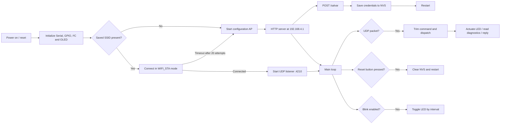

# ESP32-P4 Wi-Fi & BLE Control Gateway

[](https://www.espressif.com/)
[](https://www.arduino.cc/)
[](https://isocpp.org/)
[](#communication-architecture)
[](#license)

A compact, field-configurable ESP32-P4 control gateway that combines:

- Wi-Fi station-mode connectivity with persistent credentials;
- a captive-style access-point configuration portal;
- a UDP command interface on port `4210`;
- remote LED control, blinking, and diagnostics;
- an SSD1306 OLED event console over I²C;
- a physical button for clearing credentials and restarting;
- runtime temperature, CPU, memory, flash, network, MAC, reset, and uptime telemetry.

The complete implementation is contained in [`wifi_BLE.ino`](wifi_BLE.ino).

> **Important:** The sketch currently uses Wi-Fi and UDP. Despite the historical `wifi_BLE.ino` filename, no Bluetooth/BLE library or BLE service is implemented in the current source.

---

## Contents

- [System at a glance](#system-at-a-glance)
- [Features](#features)
- [Hardware and wiring](#hardware-and-wiring)
- [Architecture](#architecture)
- [Boot and configuration flow](#boot-and-configuration-flow)
- [Communication architecture](#communication-architecture)
- [UDP command reference](#udp-command-reference)
- [Getting started](#getting-started)
- [Testing the gateway](#testing-the-gateway)
- [Persistent storage and reset behavior](#persistent-storage-and-reset-behavior)
- [OLED and serial diagnostics](#oled-and-serial-diagnostics)
- [Project structure](#project-structure)
- [Operational notes](#operational-notes)
- [Roadmap](#roadmap)
- [License](#license)

---

## System at a glance

```text
                         ┌──────────────────────────┐
                         │        UDP client         │
                         │  laptop / phone / host    │
                         └────────────┬─────────────┘
                                      │ Wi-Fi / UDP :4210
                                      ▼
┌──────────────┐       ┌──────────────────────────┐       ┌──────────────┐
│ SSD1306 OLED │◄──────┤      ESP32-P4 gateway     ├──────►│ Status LED   │
│ I²C 0x3C     │ SDA/SCL│  Wi-Fi · UDP · WebServer │ GPIO1│              │
└──────────────┘       └───────────┬──────────────┘       └──────────────┘
                                   │
                         ┌─────────▼─────────┐
                         │ Preferences (NVS) │
                         │ SSID + password   │
                         └─────────┬─────────┘
                                   │
                         ┌─────────▼─────────┐
                         │ Reset button       │
                         │ GPIO2 / pull-up    │
                         └────────────────────┘
```

## Features

| Area | Behavior |
| --- | --- |
| Wi-Fi onboarding | If no credentials exist, starts AP `ESP32_P4_CONFIG` at `192.168.4.1`. |
| Credential storage | Saves `ssid` and `senha` in the `wifi` Preferences namespace. |
| Network control | Receives newline-friendly text commands over UDP port `4210`. |
| LED control | On, off, timed blink sequence, or continuous blinking. |
| Diagnostics | CPU, RAM, flash, reset reason, uptime, MAC, and network information. |
| Temperature | Reads the ESP32 internal temperature sensor when `TEMP` is requested. |
| Local observability | Mirrors events to Serial at `115200` baud and to the OLED history buffer. |
| Recovery | Button or `RESET_WIFI` clears saved Wi-Fi settings and restarts the device. |

## Hardware and wiring

### Pin map

| Function | GPIO / address | Direction | Notes |
| --- | ---: | --- | --- |
| Status LED | `GPIO 1` | Output | Active-high in the sketch. Use an external resistor if connecting a discrete LED. |
| Wi-Fi reset button | `GPIO 2` | Input | Configured as `INPUT_PULLUP`; connect the button between GPIO2 and GND. |
| OLED SDA | `GPIO 7` | I²C | Defined as `PIN_SDA`. |
| OLED SCL | `GPIO 8` | I²C | Defined as `PIN_SCL`. |
| OLED I²C address | `0x3C` | — | 128×64 SSD1306 display. |

### Wiring schematic

```text
ESP32-P4 Dev Kit                         SSD1306 OLED
┌─────────────────┐                     ┌─────────────┐
│ GPIO7 (SDA) ────┼────────────────────►│ SDA         │
│ GPIO8 (SCL) ────┼────────────────────►│ SCL         │
│ 3V3 ────────────┼────────────────────►│ VCC         │
│ GND ────────────┼────────────────────►│ GND         │
└─────────────────┘                     └─────────────┘

ESP32-P4 Dev Kit
┌─────────────────┐
│ GPIO1 ──[R]──► LED ──► GND             (optional external LED)
│ GPIO2 ────────┐
│               └──── Push button ───► GND
└─────────────────┘
```

> Confirm the board pinout and voltage levels before wiring. The firmware assumes a 3.3 V I²C bus and an SSD1306-compatible display at `0x3C`.

## Architecture



### Software modules

```text
setup()
 ├─ Serial @ 115200
 ├─ GPIO configuration
 ├─ I²C + SSD1306 initialization
 └─ connectWifi() ── success ──► UDP listener
                    failure ──► iniciarPortal()

loop()
 ├─ WebServer client handling (AP mode)
 ├─ UDP packet parsing
 ├─ executa_comando(command)
 ├─ physical reset-button debounce
 └─ non-blocking continuous LED blink
```

## Boot and configuration flow

1. Flash and boot the sketch.
2. The device loads `ssid` and `senha` from Preferences.
3. With valid saved credentials, it attempts up to 20 connections at 500 ms intervals.
4. If no credentials exist or the connection attempt fails, it starts:
   - **SSID:** `ESP32_P4_CONFIG`
   - **IP:** `192.168.4.1`
5. Connect a phone or computer to the access point.
6. Open `http://192.168.4.1/`.
7. Submit the Wi-Fi SSID and password.
8. The credentials are stored and the board restarts.
9. After joining the LAN, send UDP commands to the board's assigned IP on port `4210`.

## Communication architecture

```mermaid
sequenceDiagram
    participant U as User / UDP client
    participant E as ESP32-P4
    participant N as Preferences NVS
    participant O as OLED / Serial

    U->>E: UDP command (port 4210)
    E->>O: Log received command
    E->>E: Execute command
    E->>O: Log result / event
    E-->>U: UDP response from remote endpoint

    alt First boot or missing credentials
        E->>U: AP ESP32_P4_CONFIG
        U->>E: GET /
        E-->>U: Configuration HTML
        U->>E: POST /salvar
        E->>N: Store SSID and password
        E-->>U: Saved; restarting
    end
```

## UDP command reference

Commands are plain text and are trimmed before dispatch. Responses are sent to the source IP and source port of the received packet.

| Command | Description | Example response |
| --- | --- | --- |
| `LED_ON` | Turns the LED on continuously. | `LED ligado` |
| `LED_OFF` | Turns the LED off. | `LED desligado` |
| `LED_PISCA:<count>:<ms>` | Blinks a fixed number of times. | `LED piscou 5 vezes com 250 ms` |
| `LED_BLINK:<ms>` | Starts continuous blinking at the requested interval. | `Blink iniciado (500 ms)` |
| `TEMP` | Reads and returns internal temperature in °C. | `CPU Temp: 42.50` |
| `CPU` | Returns chip model, revision, cores, frequency, and free heap. | Multiple lines |
| `RAM` | Returns free, minimum free, and maximum allocatable heap. | Multiple lines |
| `FLASH` | Returns flash size, speed, sketch size, and free sketch space. | Multiple lines |
| `INIT` | Returns the ESP reset reason code. | `Motivo reset: ...` |
| `UPTIME` | Returns uptime in milliseconds. | `Uptime: ... ms` |
| `MAC` | Returns the Wi-Fi MAC address. | `MAC: ...` |
| `NET_INFO` | Returns IP, gateway, subnet, RSSI, and SSID. | Multiple lines |
| `RESET_WIFI` | Clears Wi-Fi Preferences, notifies the client, blinks, and restarts. | `WiFi zerado. Reiniciando...` |

### UDP examples

Linux/macOS:

```bash
# Replace 192.168.1.50 with the ESP32-P4 address
printf 'CPU\n' | nc -u -w1 192.168.1.50 4210
printf 'LED_ON\n' | nc -u -w1 192.168.1.50 4210
printf 'LED_BLINK:500\n' | nc -u -w1 192.168.1.50 4210
printf 'NET_INFO\n' | nc -u -w1 192.168.1.50 4210
```

PowerShell:

```powershell
$client = New-Object System.Net.Sockets.UdpClient
$bytes = [Text.Encoding]::ASCII.GetBytes("TEMP`n")
$client.Send($bytes, $bytes.Length, "192.168.1.50", 4210)
$client.Close()
```

> UDP is connectionless. The client must listen on the same local socket used to send the command if it expects the reply on that socket.

## Getting started

### Required software

- Arduino IDE 2.x or an equivalent Arduino-compatible build environment;
- ESP32 board support package with ESP32-P4 support;
- a USB data cable and the appropriate ESP32-P4 board definition.

### Required libraries

Install these libraries through the Arduino Library Manager or your preferred dependency workflow:

- `Adafruit GFX Library`;
- `Adafruit SSD1306`.

The following components are supplied by the ESP32 Arduino core:

- `WiFi.h`;
- `WiFiUdp.h`;
- `WebServer.h`;
- `Preferences.h`;
- ESP-IDF temperature sensor and system headers;
- `Wire.h`.

### Build and flash

1. Clone this repository.
2. Open `wifi_BLE.ino` in Arduino IDE.
3. Select the correct ESP32-P4 board and serial port.
4. Install the libraries listed above.
5. Compile the sketch.
6. Upload it to the board.
7. Open Serial Monitor at **115200 baud**.
8. Follow the configuration flow described above.

## Testing the gateway

A practical acceptance test is:

- [ ] OLED displays `OLED Pronto!` or the serial log reports the display failure clearly.
- [ ] First boot exposes `ESP32_P4_CONFIG`.
- [ ] `http://192.168.4.1/` loads the configuration page.
- [ ] Credentials persist across a restart.
- [ ] `LED_ON` and `LED_OFF` produce the expected GPIO1 state.
- [ ] `TEMP`, `CPU`, `RAM`, `FLASH`, `INIT`, `UPTIME`, `MAC`, and `NET_INFO` return UDP responses.
- [ ] `LED_PISCA` performs the requested finite sequence.
- [ ] `LED_BLINK` toggles without blocking the main loop.
- [ ] Holding GPIO2 low clears credentials and restarts the board.

## Persistent storage and reset behavior

Credentials are stored with the Arduino `Preferences` API under the `wifi` namespace:

```text
wifi/
├── ssid  → configured network name
└── senha → configured network password
```

There are two supported reset paths:

1. Send `RESET_WIFI` over UDP.
2. Press the button connected from GPIO2 to GND.

Both paths clear the namespace, provide a visible indication, and call `ESP.restart()`.

## OLED and serial diagnostics

The display is used as a rolling eight-line event console. Events are also printed to Serial with the `[OLED]` prefix, which makes the serial monitor useful even when no display is connected.

Typical messages include:

```text
[OLED] OLED Pronto!
[OLED] Conectando a:
[OLED] MyNetwork
[OLED] Wifi Conectado!
[OLED] 192.168.1.50
```

If the display is unavailable, the rest of the application continues operating and reports the failure through Serial.

## Project structure

```text
.
├── README.md       # This documentation
└── wifi_BLE.ino    # ESP32-P4 firmware
```

## Operational notes

- The configuration AP uses a fixed SSID and no password; use it only during local commissioning.
- UDP commands are unauthenticated. Do not expose port `4210` to an untrusted network without adding authentication and input validation.
- The HTTP configuration page transmits credentials over plain HTTP. Use an isolated setup network or add TLS and access control for production deployments.
- `LED_PISCA` is intentionally blocking while the finite blink sequence runs; avoid very large counts or delays in latency-sensitive applications.
- The internal temperature sensor is a silicon temperature reading, not an ambient-temperature measurement.
- Verify the selected board package's ESP32-P4 API compatibility for the temperature sensor driver before production use.
- Consider adding a timeout, bounded ranges, and validation for `LED_PISCA` and `LED_BLINK` values before deploying to unattended devices.

## Roadmap

Potential next improvements:

- Add authenticated HTTP and UDP communication.
- Add a password to the configuration AP.
- Rename the sketch to reflect its current Wi-Fi/UDP feature set, or implement the intended BLE service.
- Add PlatformIO configuration and automated compilation checks.
- Replace blocking finite LED blinking with a non-blocking state machine.
- Add command versioning and structured JSON responses.
- Add a formal hardware revision and tested board profile.

## License

No license is currently specified for this repository. Add a `LICENSE` file before distributing or reusing the project publicly.

---

<p align="center">
  Built for observable, remotely controllable ESP32-P4 prototypes.
</p>
