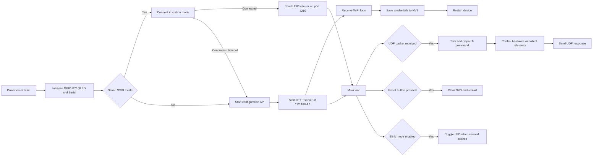
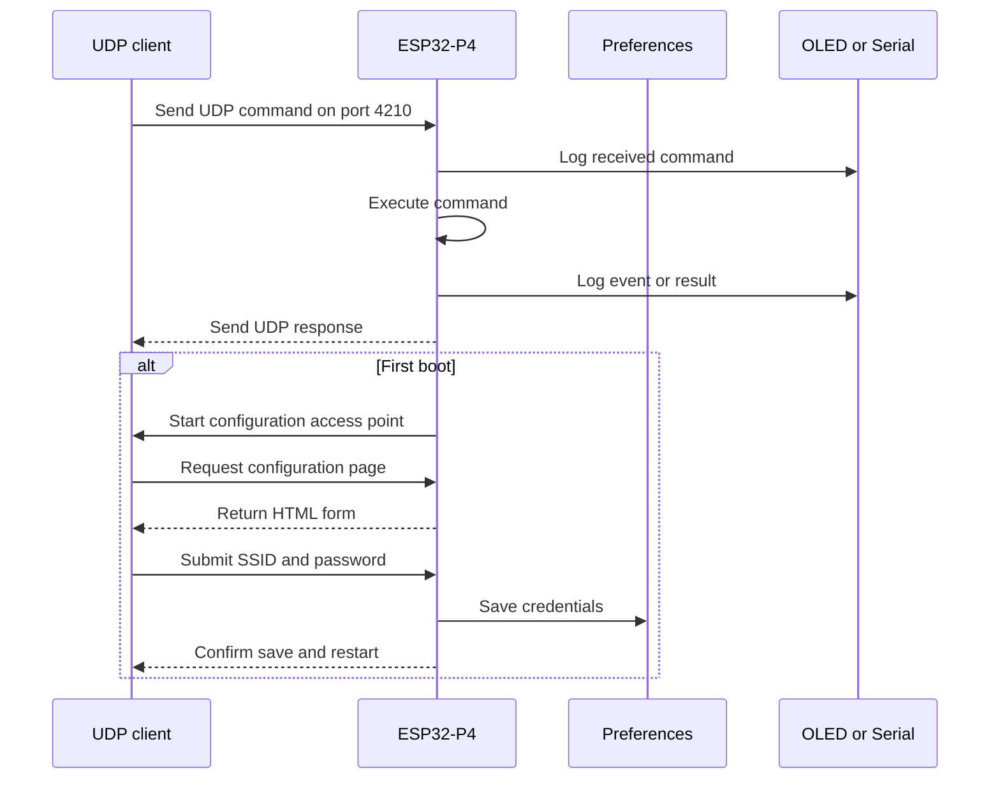

# ESP32-P4 Wi-Fi & UDP Control Gateway

[](https://www.espressif.com/)
[](https://www.arduino.cc/)
[](https://isocpp.org/)
[](#communication-architecture)

A field-configurable ESP32-P4 gateway with Wi-Fi provisioning, UDP command control, OLED diagnostics, persistent credentials, LED control, and runtime telemetry.

The implementation is contained in [`wifi_BLE.ino`](wifi_BLE.ino).

> **Note:** The filename is historical. The current sketch uses Wi-Fi, HTTP, and UDP; it does not currently implement a Bluetooth/BLE service.

## Contents

- [Features](#features)
- [Hardware and wiring](#hardware-and-wiring)
- [Architecture](#architecture)
- [Boot and configuration](#boot-and-configuration)
- [Communication architecture](#communication-architecture)
- [UDP command reference](#udp-command-reference)
- [Getting started](#getting-started)
- [Testing](#testing)
- [Storage and reset](#storage-and-reset)
- [Diagnostics](#diagnostics)
- [Security and operational notes](#security-and-operational-notes)

## Features

| Area | Behavior |
| --- | --- |
| Wi-Fi onboarding | Starts AP `ESP32_P4_CONFIG` at `192.168.4.1` when credentials are missing or connection fails. |
| Credential storage | Stores `ssid` and `senha` in the `wifi` Preferences namespace. |
| UDP control | Receives text commands on UDP port `4210` and replies to the sender. |
| LED control | Supports on, off, finite blink sequences, and continuous blinking. |
| Telemetry | Reports temperature, CPU, RAM, flash, reset reason, uptime, MAC, and network data. |
| Local observability | Mirrors events to Serial at `115200` baud and to an SSD1306 OLED. |
| Recovery | GPIO2 button or `RESET_WIFI` clears credentials and restarts the board. |

## Hardware and wiring

### Pin map

| Function | Pin / address | Configuration |
| --- | ---: | --- |
| Status LED | GPIO1 | Output, active-high |
| Reset button | GPIO2 | `INPUT_PULLUP`; connect button to GND |
| OLED SDA | GPIO7 | I²C data |
| OLED SCL | GPIO8 | I²C clock |
| OLED address | `0x3C` | 128×64 SSD1306 |

```text
ESP32-P4 Dev Kit                         SSD1306 OLED
┌─────────────────┐                     ┌─────────────┐
│ GPIO7 (SDA) ────┼────────────────────►│ SDA         │
│ GPIO8 (SCL) ────┼────────────────────►│ SCL         │
│ 3V3 ────────────┼────────────────────►│ VCC         │
│ GND ────────────┼────────────────────►│ GND         │
└─────────────────┘                     └─────────────┘

ESP32-P4 Dev Kit
┌─────────────────┐
│ GPIO1 ──[R]──► LED ──► GND             optional external LED
│ GPIO2 ────────┐
│               └──── push button ───► GND
└─────────────────┘
```

Confirm the board pinout and voltage levels before wiring. The firmware assumes a 3.3 V I²C bus.

## Architecture



### Software modules

```text
setup()
 ├─ Serial @ 115200
 ├─ GPIO configuration
 ├─ I²C + SSD1306 initialization
 └─ connectWifi()
     ├─ success  → UDP listener
     └─ failure  → iniciarPortal()

loop()
 ├─ WebServer handling in AP mode
 ├─ UDP packet parsing
 ├─ executa_comando(command)
 ├─ reset-button debounce
 └─ non-blocking continuous LED blinking
```

## Boot and configuration

1. Flash and boot the sketch.
2. The device loads `ssid` and `senha` from Preferences.
3. If credentials exist, it attempts 20 connections with a 500 ms interval.
4. If credentials are absent or the connection fails, connect to:
   - **SSID:** `ESP32_P4_CONFIG`
   - **IP:** `192.168.4.1`
5. Open `http://192.168.4.1/`.
6. Submit the Wi-Fi SSID and password.
7. The board stores the values and restarts.
8. Once connected to the LAN, send UDP commands to the assigned IP on port `4210`.

## Communication architecture

The following diagram intentionally uses conservative Mermaid sequence syntax for GitHub rendering.



## UDP command reference

Commands are plain text and are trimmed before dispatch. Responses are sent to the source IP and source port of the received packet.

| Command | Description | Example response |
| --- | --- | --- |
| `LED_ON` | Turn the LED on continuously. | `LED ligado` |
| `LED_OFF` | Turn the LED off. | `LED desligado` |
| `LED_PISCA:<count>:<ms>` | Blink a fixed number of times. | `LED piscou 5 vezes com 250 ms` |
| `LED_BLINK:<ms>` | Start continuous blinking. | `Blink iniciado (500 ms)` |
| `TEMP` | Read internal temperature in °C. | `CPU Temp: 42.50` |
| `CPU` | Report chip model, revision, cores, frequency, and free heap. | Multiple lines |
| `RAM` | Report free, minimum free, and maximum allocatable heap. | Multiple lines |
| `FLASH` | Report flash size, speed, sketch size, and free sketch space. | Multiple lines |
| `INIT` | Report the reset reason code. | `Motivo reset: ...` |
| `UPTIME` | Report uptime in milliseconds. | `Uptime: ... ms` |
| `MAC` | Report the Wi-Fi MAC address. | `MAC: ...` |
| `NET_INFO` | Report IP, gateway, subnet, RSSI, and SSID. | Multiple lines |
| `RESET_WIFI` | Clear Preferences, blink, and restart. | `WiFi zerado. Reiniciando...` |

### UDP examples

```bash
# Replace 192.168.1.50 with the ESP32-P4 address.
printf 'CPU\n' | nc -u -w1 192.168.1.50 4210
printf 'LED_ON\n' | nc -u -w1 192.168.1.50 4210
printf 'LED_BLINK:500\n' | nc -u -w1 192.168.1.50 4210
printf 'NET_INFO\n' | nc -u -w1 192.168.1.50 4210
```

PowerShell:

```powershell
$client = New-Object System.Net.Sockets.UdpClient
$bytes = [Text.Encoding]::ASCII.GetBytes("TEMP`n")
$client.Send($bytes, $bytes.Length, "192.168.1.50", 4210)
$client.Close()
```

> UDP is connectionless. A client expecting a response should listen on the same local socket used to send the command.

## Getting started

### Requirements

- Arduino IDE 2.x or an equivalent Arduino-compatible environment;
- ESP32 board support with ESP32-P4 support;
- USB data cable;
- SSD1306 OLED, if display output is required.

### Libraries

Install through the Arduino Library Manager:

- `Adafruit GFX Library`;
- `Adafruit SSD1306`.

These are provided by the ESP32 Arduino core or ESP-IDF integration:

- `WiFi.h`, `WiFiUdp.h`, `WebServer.h`, `Preferences.h`;
- `Wire.h`;
- ESP system and temperature-sensor headers.

### Build and flash

1. Clone this repository.
2. Open `wifi_BLE.ino` in Arduino IDE.
3. Select the correct ESP32-P4 board and serial port.
4. Install the required libraries.
5. Compile and upload the sketch.
6. Open Serial Monitor at **115200 baud**.
7. Follow the configuration flow above.

## Testing

- [ ] OLED displays `OLED Pronto!`, or Serial reports the display failure.
- [ ] First boot exposes `ESP32_P4_CONFIG`.
- [ ] `http://192.168.4.1/` loads the configuration page.
- [ ] Credentials persist across restart.
- [ ] `LED_ON` and `LED_OFF` control GPIO1.
- [ ] All telemetry commands return UDP responses.
- [ ] `LED_PISCA` performs the requested finite sequence.
- [ ] `LED_BLINK` toggles without blocking the main loop.
- [ ] GPIO2 clears credentials and restarts the board.

## Storage and reset

Credentials are stored using Arduino Preferences under the `wifi` namespace:

```text
wifi/
├── ssid  → configured network name
└── senha → configured network password
```

Credentials can be cleared by either sending `RESET_WIFI` over UDP or pressing the GPIO2 button. Both paths clear the namespace, provide a visible indication, and call `ESP.restart()`.

## Diagnostics

The OLED is a rolling eight-line event console. Events are also printed to Serial with the `[OLED]` prefix:

```text
[OLED] OLED Pronto!
[OLED] Conectando a:
[OLED] MyNetwork
[OLED] Wifi Conectado!
[OLED] 192.168.1.50
```

If the display is unavailable, the network and command functionality continues operating and the failure is reported through Serial.

## Project structure

```text
.
├── README.md       # Project documentation
└── wifi_BLE.ino    # ESP32-P4 firmware
```

## Security and operational notes

- The configuration AP has a fixed SSID and no password; use it only during local commissioning.
- UDP commands are unauthenticated. Do not expose port `4210` to an untrusted network without adding authentication.
- The configuration page uses plain HTTP and transmits credentials without encryption. Use an isolated setup network in production.
- `LED_PISCA` is blocking while the finite sequence runs; avoid excessive counts or delays.
- The internal temperature sensor measures silicon temperature, not ambient temperature.
- Validate the ESP32-P4 board package and temperature-sensor API before production deployment.
- Consider bounded values, command versioning, and structured responses for a production protocol.

## License

No license is currently specified for this repository. Add a `LICENSE` file before distributing or reusing the project publicly.
